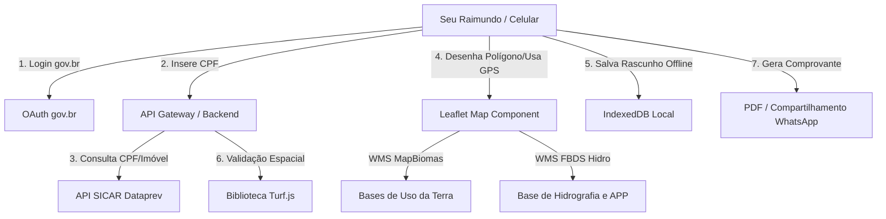

# 🌾 Jornada CAR Fácil - Esqueleto & Documentação do Projeto

Este repositório contém a documentação completa, a arquitetura e a estrutura de código inicial desenvolvida para o **Desafio 1 do haCARthon: "Jornada CAR Fácil"**. 

A solução foi pensada para simplificar a declaração e retificação do Cadastro Ambiental Rural (CAR) para pequenos e médios produtores, tendo como persona o **Seu Raimundo** — um produtor rural com baixa familiaridade tecnológica e jurídica.

---

## 📁 Estrutura de Pastas do Projeto

Abaixo está o esqueleto funcional de diretórios recomendado para a equipe estruturar a aplicação de forma modular e limpa.

```text
jornada-car-facil/
├── public/
│   ├── assets/               # Imagens, logotipos do gov.br e ícones acessíveis
│   ├── tiles-cache/          # Pasta local para servir mapa offline (fallbacks)
│   └── sw.js                 # Service Worker para controle de cache offline (PWA)
├── src/
│   ├── components/
│   │   ├── InteractiveMap.jsx # Componente React do mapa interativo (Leaflet)
│   │   ├── HeaderGov.jsx     # Cabeçalho padrão do gov.br (Identidade Visual)
│   │   ├── FooterGov.jsx     # Rodapé padrão do gov.br
│   │   └── StepIndicator.jsx # Indicador de passos simples para Seu Raimundo
│   ├── services/
│   │   ├── sicar.js          # API Client para consumo do SICAR da Dataprev
│   │   └── govbr.js          # Módulo de autenticação com o gov.br (OAuth2)
│   ├── utils/
│   │   ├── geoValidation.js  # Regras de sobreposição espacial e Código Florestal
│   │   ├── pdfGenerator.js   # Conversor de dados em PDF simplificado e legível
│   │   └── offlineStore.js   # Gerenciador de sincronização IndexedDB (PWA)
│   ├── views/
│   │   ├── Step1Welcome.jsx  # Tela 1: Boas-vindas e CPF
│   │   ├── Step2Diagnose.jsx # Tela 2: Diagnóstico Inicial
│   │   ├── Step3Mapping.jsx  # Tela 3: Desenho/GPS do Terreno
│   │   ├── Step4Valida.jsx   # Tela 4: Resultados da APP/Reserva
│   │   ├── Step5Benefits.jsx # Tela 5: Vantagens e Crédito Rural
│   │   └── Step6Share.jsx    # Tela 6: Download e WhatsApp
│   ├── App.css               # Estilização base seguindo os padrões do gov.br
│   ├── App.jsx               # Roteamento dos passos da jornada
│   └── main.jsx              # Ponto de entrada do React
├── package.json
└── README.md                 # Documentação principal
```

---

## 🛠️ 1. Arquitetura Técnica da Solução

### 💻 Stack Tecnológico
*   **Frontend**: **React.js + Vite** (PWA). O Vite permite builds ultra-rápidos e uma configuração nativa para Progressive Web App (PWA), essencial para o funcionamento offline no celular de Seu Raimundo.
*   **Estilização**: **Vanilla CSS estruturado** focado nas diretrizes do **gov.br DS** (Design System do Governo Federal) com alta legibilidade, fontes grandes (Inter/Rawline) e cores oficiais de alta acessibilidade.
*   **Mapas**: **Leaflet.js + Leaflet Geoman**. O Leaflet é extremamente leve comparado ao OpenLayers ou Mapbox, garantindo carregamento rápido em redes 3G rurais. O plugin Geoman oferece as ferramentas de desenho necessárias com uma API simples.
*   **Backend (Microserviço)**: **Node.js + Express** (ou Next.js Serverless API routes) para servir como gateway de autenticação gov.br e consultas espaciais pesadas (PostGIS), reduzindo a carga do cliente.
*   **Banco de Dados**: **PostgreSQL + PostGIS** para armazenamento e manipulação vetorial dos polígonos das propriedades rurais declaradas.

---

### 🔗 Integrações e Fluxo de Dados



#### A. API SICAR da Dataprev
A consulta ao banco do SICAR é feita a partir do CPF do produtor. O serviço `sicar.js` faz uma ponte autenticada (via token Dataprev) trazendo os dados da propriedade. Caso já exista um cadastro prévio, a geometria do imóvel é baixada em formato GeoJSON e inserida diretamente no mapa do usuário para retificação.

#### B. Login único gov.br
O fluxo de login segue o padrão **OAuth2 (Authorization Code Flow com PKCE)**. O componente redireciona Seu Raimundo para o portal gov.br. Após a autorização, o sistema resgata o nível de segurança da conta (Bronze, Prata ou Ouro). Para retificações oficiais do CAR, é exigida a conta nível Prata ou Ouro. Se o usuário for Bronze, a interface dá orientações simples em tela de como subir de nível (ex: logar pelo aplicativo do banco).

#### C. Bases Geoespaciais (FBDS & MapBiomas)
Utilizamos servidores WMS/WFS para sobreposição de camadas cartográficas:
*   **FBDS (Hidrografia 1:5.000)**: Utilizada para traçar rios, nascentes e córregos. Quando o polígono do imóvel de Seu Raimundo cruza um rio da base FBDS, a lógica calcula automaticamente a largura da APP (5m, 8m, 15m ou 30m) necessária conforme o tamanho da propriedade.
*   **MapBiomas (Cobertura e Uso do Solo)**: Fornece informações sobre onde há vegetação nativa preservada e onde há pastagem/agricultura (uso consolidado). Permite cruzar a área de vegetação com a área de APP para verificar se há déficit de regeneração.

#### D. Operação Offline (Áreas sem Sinal de Internet)
Como Seu Raimundo muitas vezes estará na fazenda sem rede móvel, a solução adota estratégias de resiliência:
1.  **PWA Service Worker**: Faz o cache completo do HTML, CSS, fontes e ícones da aplicação.
2.  **Offline Map Tiles**: Armazenamento em IndexedDB dos blocos de mapa (tiles) da região do imóvel. Se o usuário abrir o mapa em campo, a aplicação lê as imagens do cache local.
3.  **Local Sync Queue**: As edições e novos polígonos coletados em campo via GPS do celular são armazenados em formato texto (JSON) no IndexedDB. Assim que o celular detecta sinal de internet, os dados são transmitidos automaticamente para o servidor.

---

## 🗺️ 2. Fluxo Detalhado da Jornada do Usuário

A jornada é dividida em **6 etapas lineares**, desenhadas para evitar sobrecarga cognitiva.

*   **Tela 1: Boas-vindas e Identificação**
    *   *Objetivo*: Identificar o produtor e criar um ambiente de confiança.
    *   *Ações*: Login gov.br simplificado e inserção de CPF.
    *   *Acessibilidade*: Explicação em áudio de o que é a ferramenta.
*   **Tela 2: Diagnóstico Automático (Dados Pré-preenchidos)**
    *   *Objetivo*: Evitar que o produtor precise redigitar dados que o governo já possui.
    *   *Ações*: Busca no SICAR e preenchimento de nome, tamanho estimado, município e se possui cadastros anteriores.
*   **Tela 3: Mapeamento Assistido**
    *   *Objetivo*: Definir os limites físicos da terra sem complicação jurídica.
    *   *Ações*: Escolha entre caminhar pela cerca usando o GPS do celular (coleta de pontos automática) ou enviar um link de convite rápido via WhatsApp para um técnico de extensão rural (EMATER/Sindicato) ajudar a desenhar.
*   **Tela 4: Validação de APP e Reserva Legal com Linguagem Simples**
    *   *Objetivo*: Informar a situação da terra sem jargão jurídico ou multas assustadoras.
    *   *Ações*: Exibição de alertas visuais (Verde para preservado, Amarelo para áreas que precisam de plantio). Explicação didática de que "cuidar da nascente garante água para o gado".
*   **Tela 5: Benefícios e Incentivos**
    *   *Objetivo*: Mudar a percepção do CAR de "obrigação punitiva" para "oportunidade econômica".
    *   *Ações*: Mostrar o valor do selo de preservação (acesso a crédito com juros menores no Pronaf, venda para programas de alimentação escolar, isenção de ITR).
*   **Tela 6: Geração de Recibo e Compartilhamento**
    *   *Objetivo*: Conclusão da etapa e geração de valor tangível.
    *   *Ações*: Geração do PDF resumido com selo oficial e botão gigante "Enviar pelo WhatsApp" para mandar para o gerente do banco, filhos ou contador.

---

## 🎨 3. Protótipo de Telas (Descrição Textual)

### 📱 Tela 1: Entrada na Jornada
*   **Título**: Jornada CAR Fácil
*   **Textos Principais**:
    *   "Olá, produtor! Que bom ter você aqui. Nós ajudamos você a regularizar o seu sítio de forma rápida e segura."
    *   "O CAR é o documento do seu sítio. Com ele em dia, você consegue créditos no banco e evita problemas com a lei."
*   **Botões e Ações**:
    *   `[Entrar com o gov.br]` (Botão oficial azul escuro, posicionado no centro).
    *   `[ℹ️ Escutar explicação em áudio]` (Ícone de caixa de som para leitura automática do texto).
*   **Elementos Visuais**:
    *   Logotipo unificado do gov.br no topo.
    *   Ilustração acolhedora de uma pequena fazenda produtiva e sustentável.
    *   Barra de progresso no topo mostrando: `Passo 1 de 6`.

### 📂 Tela 2: O que já sabemos sobre sua terra
*   **Título**: Seus Dados Encontrados
*   **Textos Principais**:
    *   "Seu Raimundo, encontramos o seguinte imóvel em nosso sistema ligado ao seu CPF:"
    *   *Sítio Boa Esperança - 45,2 hectares - Município de Alegre/ES*
    *   "Estes dados estão corretos? Se sim, vamos avançar."
*   **Botões e Ações**:
    *   `[Sim, os dados estão corretos]` (Botão verde grande de confirmação).
    *   `[Não, preciso corrigir]` (Link cinza menor para retificação manual).
*   **Elementos Visuais**:
    *   Cartão branco com bordas arredondadas e sombra suave destacando as informações do sítio.
    *   Cores: Fundo cinza-claro oficial do gov.br com tipografia escura de alto contraste.

### 🗺️ Tela 3: Marcando os limites do seu sítio
*   **Título**: Desenhar Sítio no Mapa
*   **Textos Principais**:
    *   "Precisamos marcar onde fica o limite da sua cerca. Escolha a forma mais fácil para o senhor:"
*   **Botões e Ações**:
    *   `[📍 Caminhar e Marcar (GPS)]`: "Clique aqui se estiver no sítio. Caminhe ao redor da cerca e o celular marca os pontos sozinho."
    *   `[🤝 Pedir ajuda a um técnico (WhatsApp)]`: "Clique aqui para enviar um convite e o mapa para o técnico do Sindicato ou EMATER te ajudar a desenhar."
*   **Elementos Visuais**:
    *   Mapa interativo ocupando 60% da tela com botões de controle gigantes (+ e - para zoom).
    *   Ícone de pino GPS azul pulsante indicando a localização atual.

### ⚖️ Tela 4: Saúde Ambiental da sua Terra
*   **Título**: Diagnóstico do seu Sítio
*   **Textos Principais**:
    *   "Analisamos as águas e as matas da sua terra. Veja o resultado:"
    *   🟢 **Água Protegida**: "Parabéns! A mata na beira do seu córrego está preservada."
    *   🟡 **Reserva Legal**: "Seu sítio tem 8 ha de mata nativa. Como você é pequeno produtor, sua área está aprovada e protegida por lei."
*   **Botões e Ações**:
    *   `[Entendi e concordo]` (Botão verde de avanço).
*   **Elementos Visuais**:
    *   Cards coloridos (Verde para OK, Amarelo/Laranja para atenção) com ícones grandes e amigáveis de folhas e rios.
    *   Sem termos complexos como "sobreposição de polígono de classe secundária".

### 💰 Tela 5: Vantagens de regularizar
*   **Título**: Seus Benefícios Garantidos
*   **Textos Principais**:
    *   "Estar com o CAR em dia traz muitas coisas boas para o senhor:"
    *   💵 **Pronaf**: "Descontos e juros menores para comprar sementes e equipamentos."
    *   🛡️ **Sem Multas**: "Segurança para trabalhar sem medo de fiscalização."
    *   📜 **Selo Verde**: "Destaque seu sítio na venda de leite e hortaliças."
*   **Botões e Ações**:
    *   `[Ir para o Passo Final]` (Botão azul gov.br).
*   **Elementos Visuais**:
    *   Ícones de moedas, tratores e escudos verdes. Foco em tom positivo e motivador.

### 📄 Tela 6: Seu CAR está Pronto!
*   **Título**: Concluído com Sucesso!
*   **Textos Principais**:
    *   "Pronto, Seu Raimundo! O diagnóstico prévio do seu CAR foi gerado."
    *   "O arquivo em PDF foi salvo no seu celular. Você pode imprimir ou enviar para o banco."
*   **Botões e Ações**:
    *   `[🟢 Enviar Comprovante por WhatsApp]` (Botão destacado em verde do WhatsApp, ação principal).
    *   `[📥 Baixar PDF da Declaração]` (Botão cinza de download).
*   **Elementos Visuais**:
    *   Selo grande de "Certificado Emitido" com o brasão da República.
    *   Interface limpa com confetes virtuais discretos celebrando o sucesso do produtor.

---

## 🚀 4. Código Inicial (Esqueleto Funcional)

Para acelerar o desenvolvimento durante os 3 dias de hackathon, criamos os seguintes arquivos funcionais com as principais integrações exigidas:

1.  **Integração SICAR da Dataprev**: [sicar.js](file:///C:/Users/admin/.gemini/antigravity/scratch/jornada-car-facil/src/services/sicar.js) (Faz autenticação OAuth e consulta as propriedades ligadas ao CPF do produtor).
2.  **Login gov.br via OAuth**: [govbr.js](file:///C:/Users/admin/.gemini/antigravity/scratch/jornada-car-facil/src/services/govbr.js) (Implementa o redirecionamento seguro e troca de autorizações, além de detectar o nível Bronze/Prata/Ouro do usuário).
3.  **Mapa Interativo Leaflet**: [InteractiveMap.jsx](file:///C:/Users/admin/.gemini/antigravity/scratch/jornada-car-facil/src/components/InteractiveMap.jsx) (Interface de mapas customizada com WMS MapBiomas/FBDS e suporte a GPS do aparelho).
4.  **Validador do Código Florestal**: [geoValidation.js](file:///C:/Users/admin/.gemini/antigravity/scratch/jornada-car-facil/src/utils/geoValidation.js) (Usa Turf.js para calcular interseções espaciais e aplica as regras simplificadas de recomposição para pequenos produtores).
5.  **Gerador de PDF Simplificado**: [pdfGenerator.js](file:///C:/Users/admin/.gemini/antigravity/scratch/jornada-car-facil/src/utils/pdfGenerator.js) (Usa jsPDF e AutoTable para gerar o comprovante amigável para Seu Raimundo levar ao banco).

---

## 📅 5. Estratégia para o MVP de 3 Dias

### 🎯 Escopo da Solução

| Essencial (Must-Have - Foco Total) | Para Depois (Nice-to-Have - Futuro) |
| :--- | :--- |
| Login simplificado (Mock gov.br / fluxos prontos) | Integração oficial com token real gov.br Ouro |
| Consulta de imóveis via CPF (com dados fixos/mock do SICAR) | Envio em tempo real com gravação direta no banco do SICAR |
| Mapa acessível no celular com GPS e desenho de polígono | Edição complexa de múltiplos vértices com ferramentas CAD |
| Validação simplificada de APP (Turf.js local) | Análise espacial tridimensional de curvas de nível automáticas |
| Geração e exportação do PDF (Comprovante) | Integração direta com APIs dos Bancos para liberação de crédito |
| Envio do comprovante por link direto de WhatsApp | Sistema completo de login de técnicos de extensão rural |

---

### 👥 Divisão de Tarefas da Equipe (4 pessoas)

*   **Pessoa 1: Desenvolvedor(a) Frontend UI/UX**
    *   Criação e estilização das telas baseadas no Design System do gov.br.
    *   Garantia da acessibilidade (leitor de tela, botões grandes, contraste).
*   **Pessoa 2: Desenvolvedor(a) Frontend Mapas & Geo**
    *   Configuração do Leaflet.js e integração com GPS.
    *   Consumo de WMS da FBDS e MapBiomas para exibição em tela.
*   **Pessoa 3: Desenvolvedor(a) Backend / Integrações**
    *   Construção do Gateway Node.js.
    *   Lógica de validação com Turf.js no backend ou utilitários do front.
    *   Serviço de geração do PDF e formatação de dados.
*   **Pessoa 4: Designer / Product Owner & Pitch**
    *   Refinamento da linguagem (copwriting acolhedor para Seu Raimundo).
    *   Produção do roteiro, gravação do vídeo do Pitch e montagem da apresentação dos slides.

---

### ⏱️ Cronograma Dia a Dia

#### Dia 1 (26/06) - Alinhamento e Estrutura
*   **Manhã**: Setup dos repositórios locais, criação da estrutura de pastas baseada no esqueleto e distribuição de tarefas.
*   **Tarde**: Implementação da identidade visual do gov.br nas telas 1, 2 e 5.
*   **Noite**: Configuração básica do Leaflet no celular com GPS funcionando.

#### Dia 2 (27/06) - Integração e Lógica Geo
*   **Manhã**: Criação do validador de intersecção espacial (`geoValidation.js`) com Turf.js.
*   **Tarde**: Integração das camadas WMS de rios e matas nativas no mapa.
*   **Noite**: Desenvolvimento do fluxo de geração e compartilhamento de PDF. Ajuste de rotas offline.

#### Dia 3 (28/06) - Polimento, Testes e Pitch
*   **Manhã**: Testes ponta a ponta simulando "Seu Raimundo" (com celular em modo avião). Correção de bugs visuais.
*   **Tarde**: Fechamento dos códigos, congelamento do repositório (Freeze) e gravação da tela do celular rodando o app.
*   **Noite**: Edição do vídeo de Pitch de 3 minutos e submissão na plataforma do Hackathon.

---

## 🎤 6. Pitch de Apresentação (Vídeo de 3 Minutos)

**Roteiro sugerido para gravação (Cronometrado: ~180 segundos):**

*(Cena 1: Apresentador olhando para a câmera com um celular na mão ou imagem de um produtor rural trabalhando)*

> **[0:00 - 0:30] O Problema**
> "Este é o Seu Raimundo. Ele é um dos milhões de pequenos agricultores que colocam comida na mesa dos brasileiros. Mas, hoje, ele corre o risco de perder o acesso a linhas de crédito cruciais para o seu sustento. O motivo? A burocracia do Cadastro Ambiental Rural, o CAR. O sistema atual do CAR é complexo, exige computadores potentes, internet estável e um vocabulário jurídico que afasta quem mais precisa de ajuda. Hoje, retificar ou declarar o CAR exige pagar assessores caros, inviabilizando a vida do pequeno produtor rural."

*(Cena 2: Transição de tela mostrando a interface do Jornada CAR Fácil rodando no celular)*

> **[0:30 - 1:15] A Solução: Jornada CAR Fácil**
> "Para resolver esse abismo digital, criamos a **Jornada CAR Fácil**. Uma plataforma de código aberto integrada ao ecossistema gov.br, desenhada especificamente para dispositivos móveis de baixo desempenho. O Seu Raimundo entra de forma segura com sua senha gov.br. Imediatamente, nosso sistema busca no banco do SICAR tudo o que o governo já sabe sobre a terra dele. Sem papelada, sem redigitar informações."

*(Cena 3: Demonstração da tela de mapas e validação no celular)*

> **[1:15 - 2:00] Como Funciona na Prática (Diferencial)**
> "O grande diferencial está na simplicidade do mapeamento. Seu Raimundo pode simplesmente ligar o GPS do celular e caminhar ao longo de sua cerca para desenhar seu terreno. Se precisar de ajuda, ele envia um convite rápido via WhatsApp para que um técnico de extensão rural complete o traçado à distância. Em tempo real, cruzamos a fazenda com bases geográficas oficiais, como os rios da FBDS e a vegetação do MapBiomas. Usando regras do Código Florestal para pequenos proprietários, a plataforma avisa ao Seu Raimundo: 'Você tem mata nativa protegida e precisa plantar uma faixa de apenas 5 metros ao redor do córrego'."

*(Cena 4: Mostrando a tela de benefícios e o PDF final sendo gerado e enviado pelo WhatsApp)*

> **[2:00 - 2:30] Tecnologia e Impacto**
> "Toda essa tecnologia roda offline, salvando os dados localmente no celular mesmo onde não há qualquer sinal de internet. Ao final da jornada, Seu Raimundo recebe um diagnóstico resumido, sem jargões, e gera um comprovante em PDF com um clique. Ele pode enviar esse documento pelo WhatsApp direto para o gerente do banco para liberar seu financiamento agrícola. Ele deixa de ser um 'infrator em potencial' para se tornar um produtor ambientalmente regularizado e elegível a incentivos financeiros."

*(Cena 5: Encerramento com o logotipo do projeto e os contatos da equipe)*

> **[2:30 - 3:00] Conclusão**
> "A Jornada CAR Fácil aproxima o pequeno produtor do governo, reduz o custo da regularização e promove a preservação ambiental assistida por quem vive da terra. Simples para o produtor, transparente para o governo, bom para o Brasil. Muito obrigado."

---

*Para rodar localmente ou testar os templates criados nesta jornada, certifique-se de configurar seu ambiente de desenvolvimento React com Leaflet e jsPDF instalados.*
